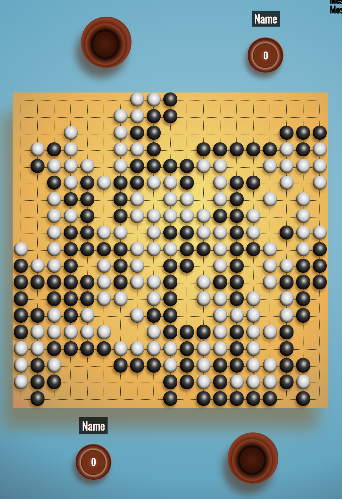
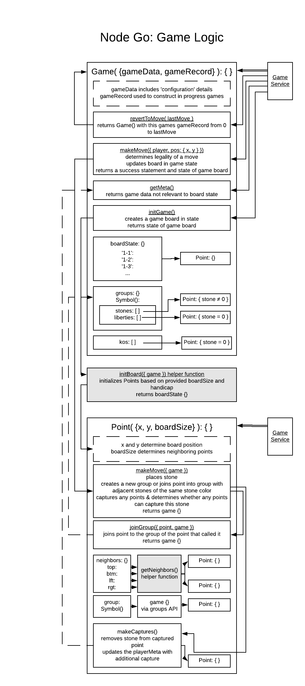
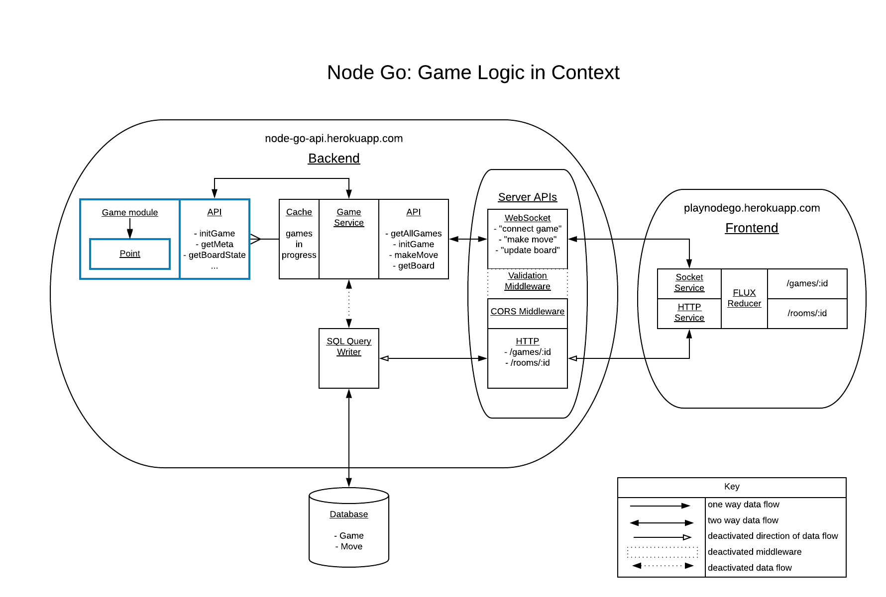
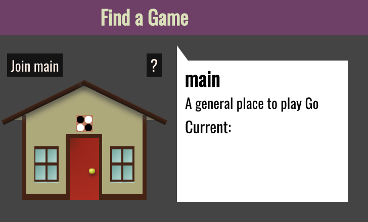
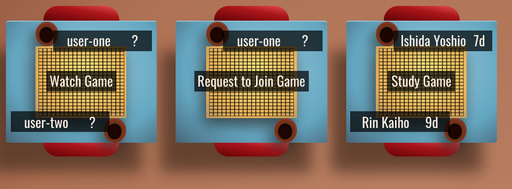

# Node Go
A browser application to play Go in real time.

[The project in it's current state](https://play-node-go.herokuapp.com/)  
[Client only prototype](https://sorrelbri.github.io/browser-go-proto/)



[About Go](#the-game-of-go)  
[Technical Challenges](#technical-challenges)  
[Setup For Development](#setup)  
[Known Bugs](#known-bugs)  
[Roadmap](#roadmap)  
[Features](#features)  
[Tech](#built-with)  

---
## The Game of Go
Go is a 2 player abstract strategy game of perfect information.

Players take turns placing playing pieces called stones on the intersections of a gridded board. This board is usually a square 19 points across. Stones remain on the points at which they are placed unless they are captured by the opposing player. Capture occurs when a stone or group of stones no longer has any adjascent empty points.

Play ends when both players agree that they have exhausted all advantageous moves. Scoring is determined by counting and comparing the area controlled by either player.

For a more detailed explanation of the rules, please see [my previous illustrated explanation of the game of go](https://github.com/sorrelbri/browser-go-proto#the-game-of-go) or the [American Go Association's Concise Rules of Go.](https://www.usgo.org/aga-concise-rules-go)

---
## Technical Challenges
### Modeling Game State
A go board typically consists of 361 points which can exist in a number of states. Points can influence the state of points that are orthogonal neighbors. This relationship can be thought of as an undirected graph, with each point being a vertex typically of degree 4. Special cases include 'edge' points, whose degree is 3 or, in the case of corner points, 2.

Many of the methods that manage the state of the game and of the board, make use of this graph representation. Groups are contiguous points with the same color stone which are important in determining the life or death of stones on the board. When a player makes a move, (provided that move is legal,) the point at which the move is made will utilize a breadth-first graph traversal calling a `joinGroup` method on each point with the same color stone.

Adjacent points without stones are very important to the state of a point as well. These are known as liberties, and so long as a group of stones has at least one point with at least one liberty, that group remains alive and on the board. Therefore, the `joinGroup` method also utilizes a depth first traversal to mark all of the liberties of a group. Both the stones and the liberties of the group are memoized on the Game object.



### Game Records
Game records are modeled as a list where each move has the type `{player: <string: player color>, pos: {x: <integer>, y: <integer>}, number: <integer>}`.

The database `move` table contains additional information `number`, `game_record`, and `prior_move` in addition to a foreign key for a `game` row. `number` represents the move number in a game record (for now this corresponds to list position), `game_record` is a boolean representing whether the move was 'official' or is an alternate move used in study, and `prior_move` is a reference to another `move` row allowing for the construction of a tree model for the game (see [Expanding this representation](#expanding-this-representation), below.)

There is a backend service that processes this list of moves into a current board state ([Modeling Game State](#modeling-game-state).) On the frontend, users have the option of expanding a menu to view the move order in the format below.

![Game Record: Black and white 19x19 grid with moves represented as circles filled in with stone color and marked with move number. Below the grid is an overflow area for moves made at previously played points in the format /[new move number and color at old move number and color/]](public/game-record.png)

This is a customary representation of game records printed in Go literature. A frontend service processes the list of moves and plots each move onto a `<canvas>` element drawn to resemble the grid lines on a board, with moves that are placed at prior points plotted on an additional `<canvas>` element below. 

#### Expanding this representation
The list representation is expanded for alternate game paths with the addition of sub-lists in places where paths diverge. Alternate game paths allow users to study completed games by playing out the consequences of moves not in the completed game. Each move with a diverging path contains lists for each path, with the official path being the first.

### Caching multiple in-progress games
  

### Partitioning Game Rooms
Finding a game starts with joining a game room.

Watch an in progress game, join a game, or study a historic game.


---
## Setup
### Local Repo
```sh
$ git clone https://github.com/sorrelbri/node-go.git
```

### Install Deps
```sh
$ npm run bootstrap
```  
Runs lerna `bootstrap` command installing dependencies for project, development and package dependencies

### Initialize Database
#### Download PostgreSQL 
To verify PostgreSQL installation:  
```sh
$ psql -V
```
Node Go API was built with version 11.4.
[See documentation for Postgres download.](https://www.postgresql.org/download/)

#### Create Databases
```sh
$ psql
# psql(11.4)
```
```sql
CREATE DATABASE node-go;
CREATE DATABASE node-go-test; # testing database
```

### Configure Environment
```sh
$ touch packages/server/.env
```

```
# .env
NODE_ENV=development
PORT=# set development port for API
REACT_ADDRESS=http://localhost:3000 # default
PG_CONNECTION_STRING=postgresql://localhost:5432/node-go
PG_CONNECTION_STRING_TEST=postgresql://localhost:5432/node-go-test
JWT_SECRET=# generate a secret key for JWT signing algorithm
TEST_SECRET=# same as above, for test environment
SALT_ROUNDS=# set number of salt rounds for bcrypt hashing function
DOMAIN=localhost
USER_ONE_PASSWORD=# credentials for testing with 
USER_ONE_EMAIL=# same as above
```

### Smoke test
```sh
$ lerna run test
```

### Run Database Migrations
```sh
$ cd packages/server; npm run migrate; npm run seed
```

### Running in development
```sh
$ cd packages/server
$ npm start # or if you have nodemon
$ nodemon
```
```sh
$ cd packages/play-node-go
$ npm start
```

---
## Known Bugs
- game end logic not implemented on front end yet
- no authorization for game moves
- websocket connections may remain open, pooling prevents runaway leaks, but tests may hang

---
## Roadmap 
### 6/20
1. Frontend implementation of game end logic
2. Auth for games
3. Game request creation
### 7/20
1. Generate game records
2. Implement chat
3. Implement study mode

---
## Features
- [x] Realtime play
- [x] Account authentication
- [ ] Chat
- [ ] Study mode
- [ ] Multiple game settings
- [ ] Customizable board size
- [ ] Download games in .sgf format

---
## Built with
- [Express](https://expressjs.com)
- [React](https://reactjs.org)
- [PostgreSQL](https://postgresql.org)
- [Socket.io](https://socket.io)
- [Sass](https://sass-lang.com)
### Management & Deployment
- Lerna
- CircleCI